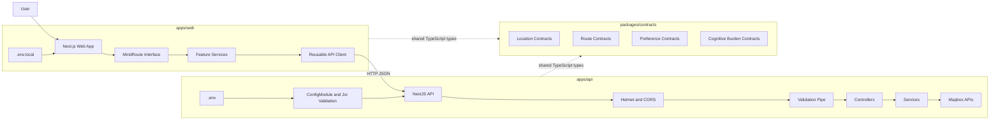
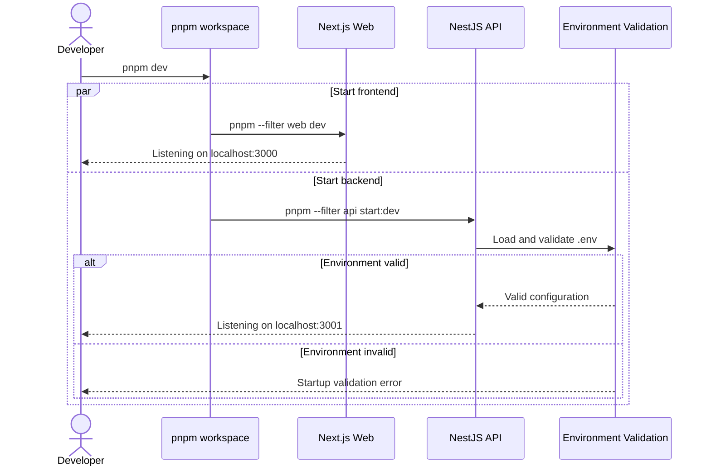
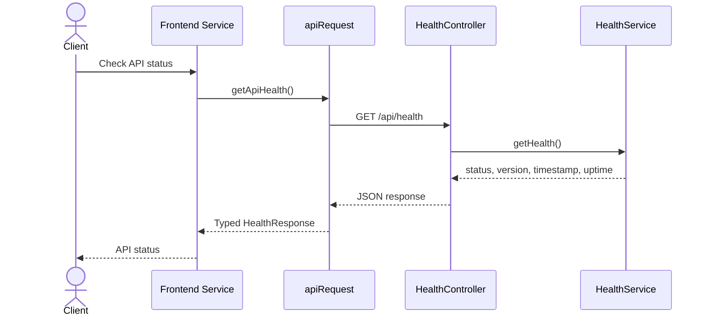
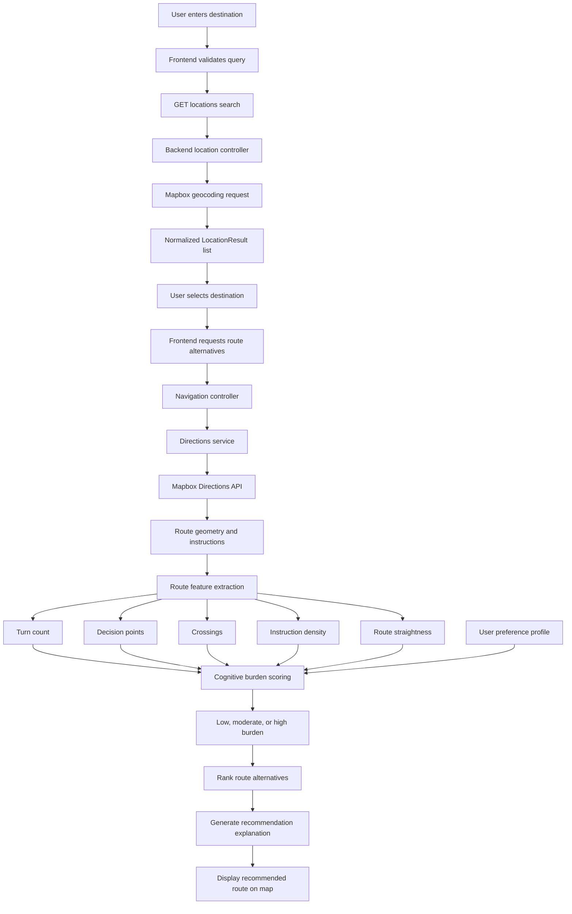
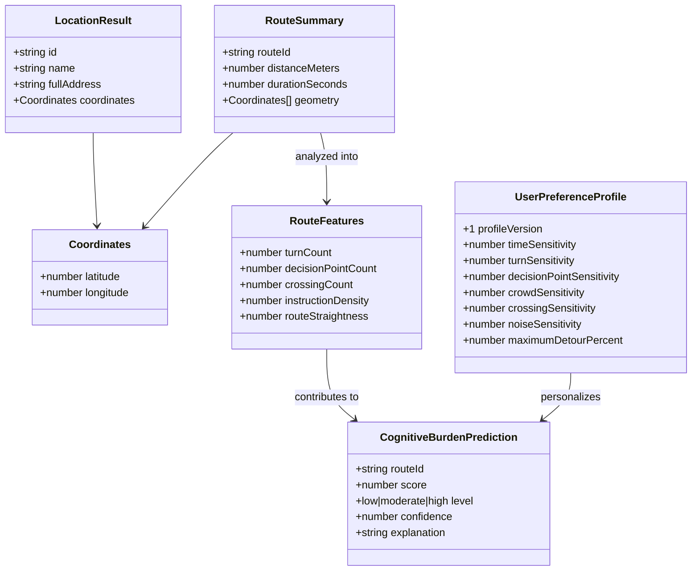
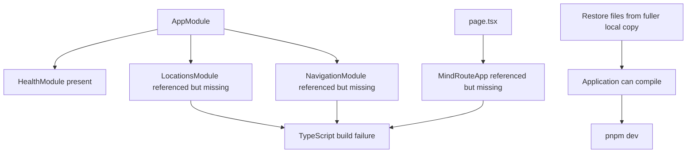

# MindRoute Architecture and Function Flow

This file contains Mermaid diagrams for the current MindRoute architecture and the intended adaptive-navigation pipeline.

## System Architecture



## Development Startup Flow



## Health Check Flow



## Intended Adaptive Navigation Flow



## Backend Request Pipeline

```mermaid
flowchart LR
    REQ[Incoming Request] --> HELMET[Helmet Security Headers]
    HELMET --> CORS[CORS Origin Check]
    CORS --> PREFIX[/api Global Prefix]
    PREFIX --> VALIDATE[ValidationPipe]
    VALIDATE --> CONTROLLER[Controller]
    CONTROLLER --> SERVICE[Service]
    SERVICE --> RESPONSE[Typed JSON Response]

    CORS -->|Origin rejected| E1[CORS Error]
    VALIDATE -->|Invalid payload| E2[400 Validation Error]
    SERVICE -->|External API fails| E3[Service Error]
```

## Shared Contract Relationships



## Current Uploaded-ZIP Dependency Gap


